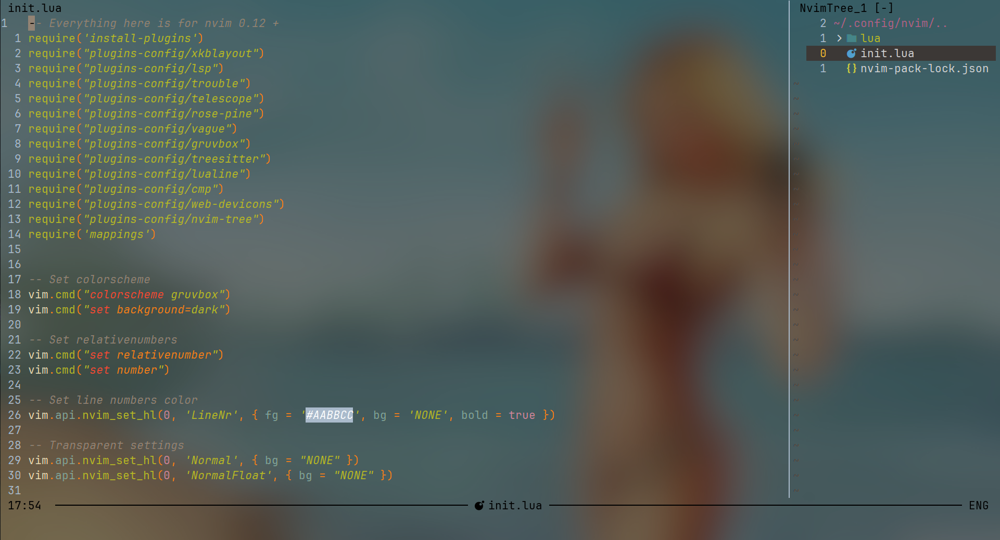
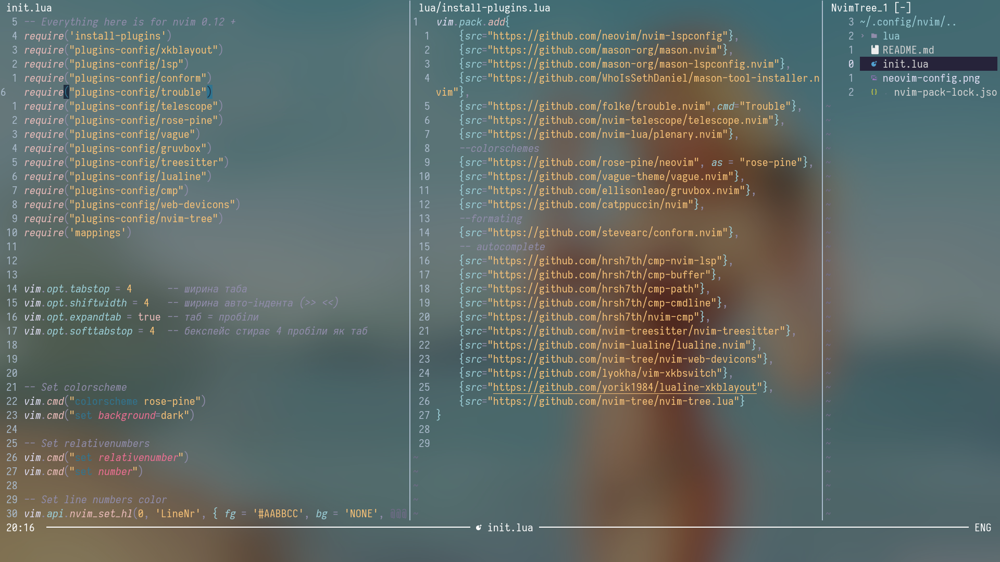

! **CAUTION** ! *"lua/plugins-config/xkblayout.lua"* uses **MY relative path**, make sure to use YOUR own

LSPs configuration for: Python, Ruby, Lua, JavaScript, Golang

Keybindings are really intuitive, this config is BASED istg
